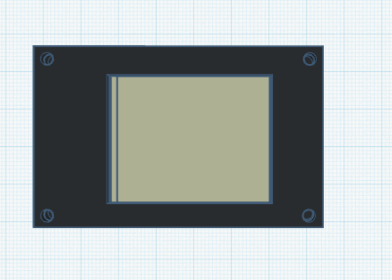
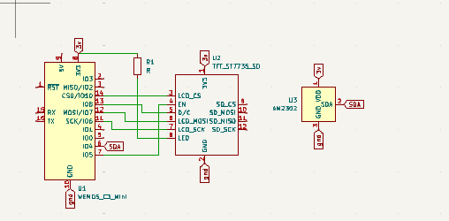
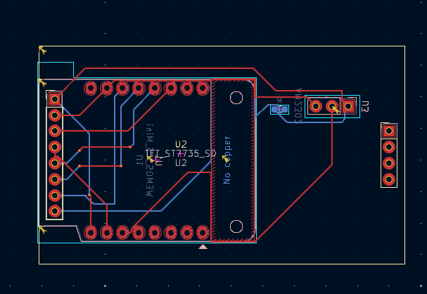

# Wemos C3 Mini Weather and Room Monitor

This project integrates a Wemos C3 Mini, an ST7789 display, and a DHT11/DHT22 sensor to:
- Display room temperature and humidity.
- Fetch real-time weather updates from an online API.

---

## **Project Components**
1. **Wemos C3 Mini** - The microcontroller for running the MicroPython code.
2. **ST7789 Display** - To show room data and weather updates.
3. **DHT11/DHT22 Sensor** - To measure room temperature and humidity.
4. **Wi-Fi** - For internet connectivity to access weather APIs.

## **Further Plans**
- Use Bluetooth from the phone for notification support.
- Add IoT functionality to control a smart fan.
- Show calendar updates with the help of the phone.

1. **3d box**
     
2. **Schematics**.
   
3. **PCB* 
     